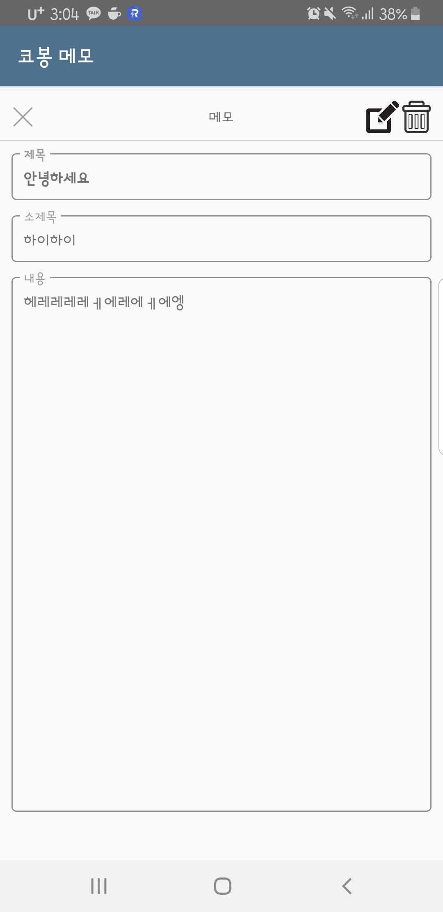
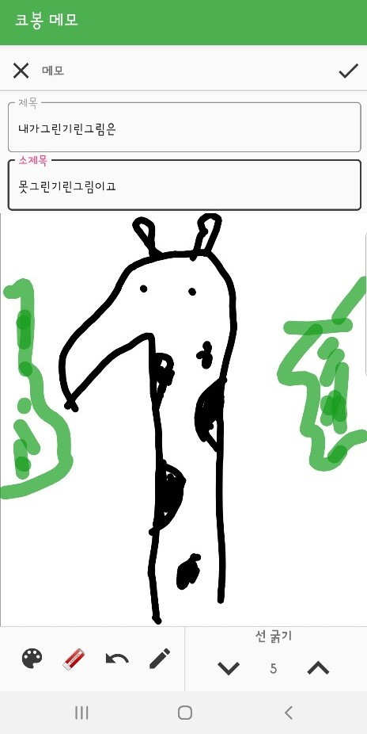

## **CobongMemo Application** / 정우진 (wjddnwls918)
**CobongMemo** 는 텍스트, 음성, 손글씨의 메모와 일정을 관리할 수 있는 기능을 가진 앱입니다.

### 개발 환경
- 주 언어 : Kotlin
- 부 언어 : JAVA
- 아키텍처 : MVVM(Model-View-ViewModel)

------------------------------------------

### 사용 라이브러리
- [ROOM](https://developer.android.com/jetpack/androidx/releases/room)
- [Viewmodel](https://developer.android.com/topic/libraries/architecture/viewmodel)
- [LiveData](https://developer.android.com/topic/libraries/architecture/livedata)
- [Databinding](https://developer.android.com/topic/libraries/data-binding?hl=ko)
- [coroutine](https://codelabs.developers.google.com/codelabs/kotlin-coroutines/#0)

- [DrawableView](https://github.com/PaNaVTEC/DrawableView)

------------------------------------------

### 주요 기능

#### 1.메모(텍스트, 음성, 손글씨)

##### 1)메인

  
  
##### 2)텍스트

  
  
  
 

 
 
##### 3)음성
 

  

  
 

 
##### 4)손글씨 
 

  

  
  
  
 
 

 
#### 2.일정

##### 1)달력

  

  
 
 

 
##### 2)일정 추가

  

  
 
 

##### 3)장소 검색 (Kakao REST API, MAP)

  

 
 
 

------------------------------------------
### 리팩토링

#### 전

  

  
  

#### 후

  

  
  
  
  
 

------------------------------------------

[[2018-07-26]](https://youtu.be/2yICxRnV6IM)

[[2018-09-10]](https://youtu.be/kTfF_A4JfCQ)

[[플레이스토어 베타버전 링크]](https://play.google.com/store/apps/details?id=cobong.jeongwoojin.cobongmemo.cobongmemo)

[[2019-07-15]](https://youtu.be/Kb7Vr5lZ06E)

------------------------------------------
- KOREATECH
- Computer Science Engineering
- UOC LAB
- email : wjddnwls918@naver.com
- phone : 010-9368-5828
